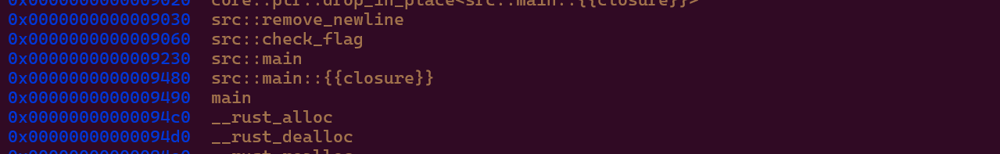

**Debug với gdb ta thấy**

**Ok h sem hàm check flag**
- nó đang thiết lập 1 số lượng lớn hàm để kiểm tra từng kí tự của ta 

**Coi thử 1 hàm** 

**So sánh dil với 0x48 vậy đây chính là kí tự "H" trong flag**

 

**Vòng lặp gọi tưngf hàm trong mảng này để ktra** 

**Việc đơn giản là disassemble từng hàm và coi kí tự được so sánh** 
**Tôi viết 1 scipt để tự động cho nhanh Lưu ý phải đặt break point ở điểm các hàm check đã được thiết lập vào mảng check này**

**Kết quả thu đc gián vào deppsek nó tự convert thành flag** 
Hàm 0: cmp $0x48, %dil → 0x48 là 'H'.

Hàm 1: cmp $0x54, %dil → 0x54 là 'T'.

Hàm 2: cmp $0x42, %dil → 0x42 là 'B'.

Hàm 3: cmp $0x7b, %dil → 0x7b là '{'.

Hàm 4: cmp $0x64, %dil → 0x64 là 'd'.

Hàm 5: cmp $0x30, %dil → 0x30 là '0'.

Hàm 6: cmp $0x6e, %dil → 0x6e là 'n'.

Hàm 7: cmp $0x74, %dil → 0x74 là 't'.

Hàm 8: cmp $0x5f, %dil → 0x5f là '_'.

Hàm 9: cmp $0x70, %dil → 0x70 là 'p'.

Hàm 10: cmp $0x34, %dil → 0x34 là '4'.

Hàm 11: cmp $0x6e, %dil → 0x6e là 'n'.

Hàm 12: cmp $0x31, %dil → 0x31 là '1'.

Hàm 13: cmp $0x63, %dil → 0x63 là 'c'.

Hàm 14: cmp $0x5f, %dil → 0x5f là '_'.

Hàm 15: cmp $0x63, %dil → 0x63 là 'c'.

Hàm 16: cmp $0x34, %dil → 0x34 là '4'.

Hàm 17: cmp $0x74, %dil → 0x74 là 't'.

Hàm 18: cmp $0x63, %dil → 0x63 là 'c'.

Hàm 19: cmp $0x68, %dil → 0x68 là 'h'.

Hàm 20: cmp $0x5f, %dil → 0x5f là '_'.

Hàm 21: cmp $0x74, %dil → 0x74 là 't'.

Hàm 22: cmp $0x68, %dil → 0x68 là 'h'.

Hàm 23: cmp $0x65, %dil → 0x65 là 'e'.

Hàm 24: cmp $0x5f, %dil → 0x5f là '_'.

Hàm 25: cmp $0x33, %dil → 0x33 là '3'.

Hàm 26: cmp $0x72, %dil → 0x72 là 'r'.

Hàm 27: cmp $0x72, %dil → 0x72 là 'r'.

Hàm 28: cmp $0x6f, %dil → 0x6f là 'o'.

Hàm 29: cmp $0x72, %dil → 0x72 là 'r'.

Hàm 30: cmp $0x7d, %dil → 0x7d là '}'.

2. Ghép các ký tự lại
Từ các giá trị trên, ta ghép lại thành flag:

**HTB{d0nt_p4n1c_c4tch_the_3rror}**