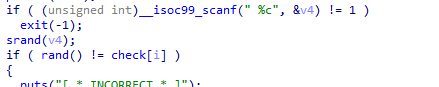
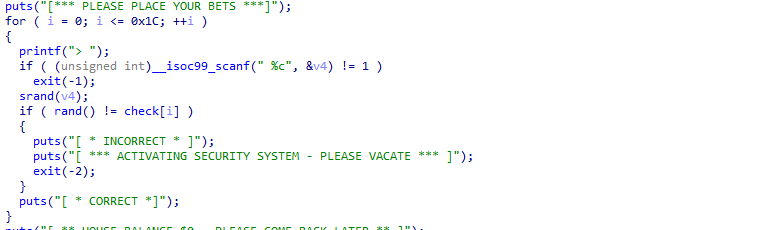
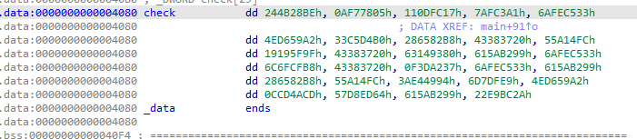
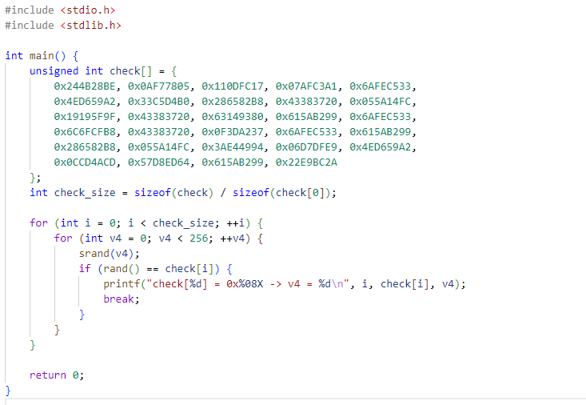
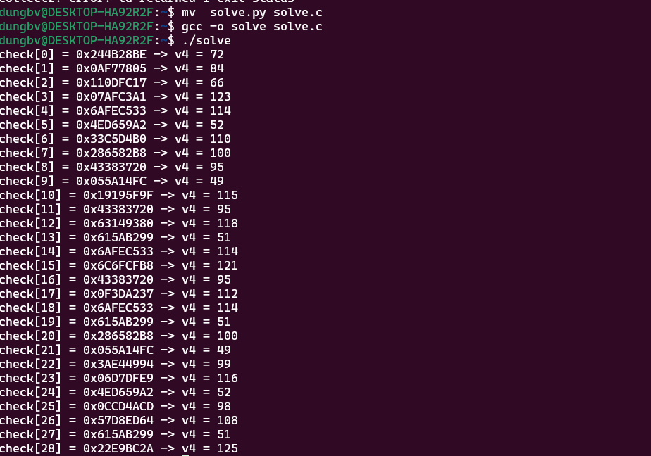

**Ta thấy rằng input đc nhập vào sẽ đc truyền vào srand đẻ tạo ra seed value**

**giá trị này sẽ đc hàm rand() dùng để tạo ra 1 bộ số rand**
**sau đó đc so sánh với giá trị trong mảng check[] mảng này nằm sẵn trong trương trình** 

->> **Chỉ cần brute các kí tư trong bản ascii đẻ tìm ra mã gốc** 

[Flag]
